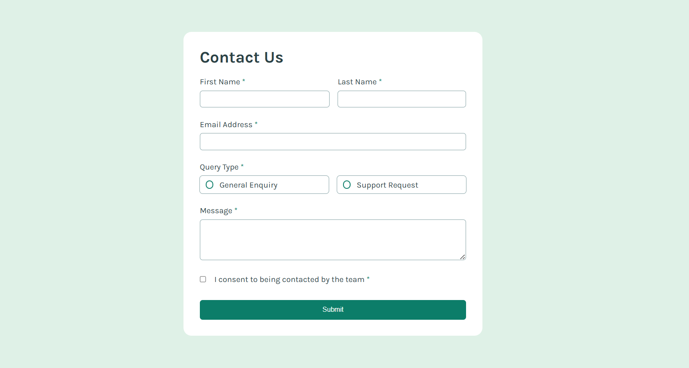
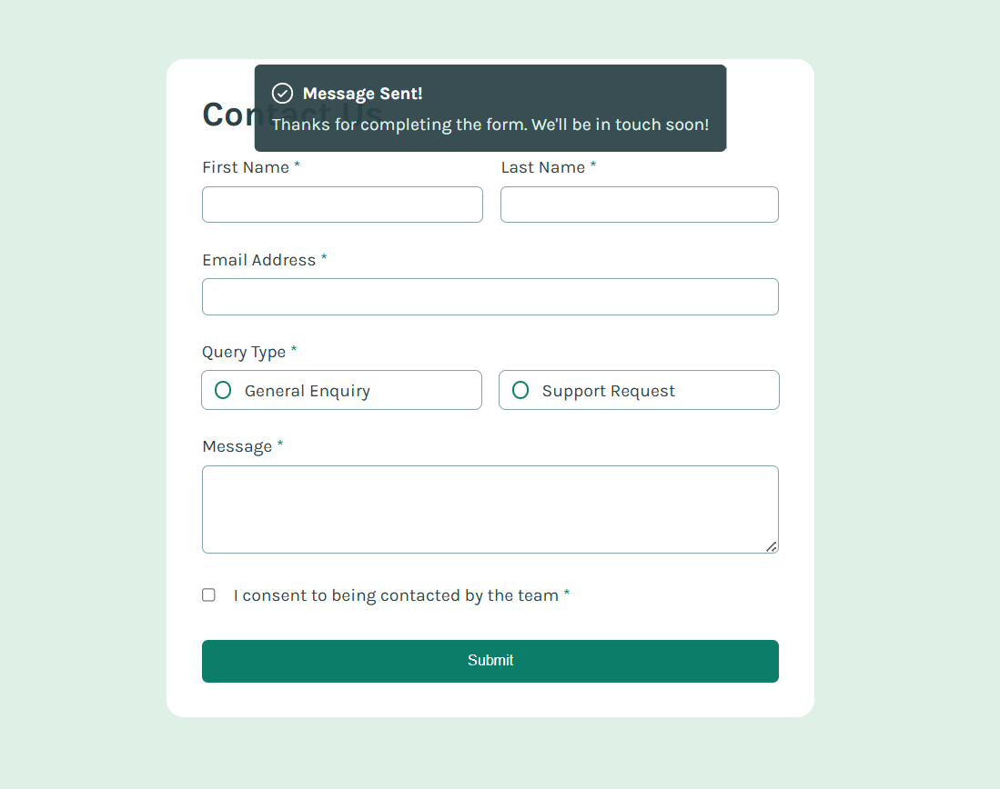
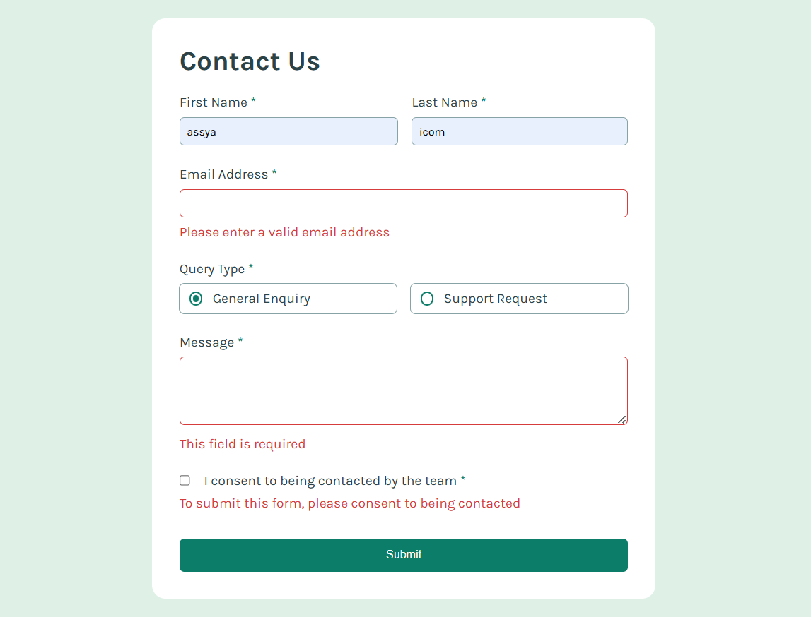
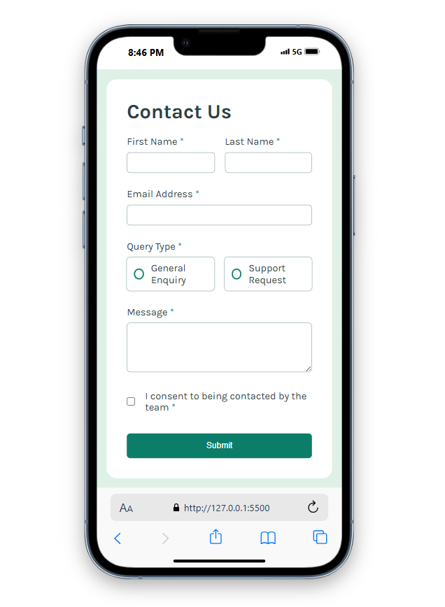

# Contact Form

This is a responsive contact form built as a solution to a Frontend Mentor challenge.

## 🚀 Features

- Responsive layout
- Accessible form validation using vanilla JavaScript
- Smooth success message animation
- Custom radio and checkbox styling
- Clean, semantic HTML & CSS with variables

## 🔧 Built With

- HTML5
- CSS3 (with custom properties/variables)
- Vanilla JavaScript (no frameworks)
- Google Fonts: [Karla](https://fonts.google.com/specimen/Karla)

## 📷 Preview

  
  

  
  

## ✅ What I Learned

- Validating form fields using JavaScript
- Styling custom radio buttons and checkboxes
- Handling success messages with animation using CSS
- Better understanding of accessibility in forms

